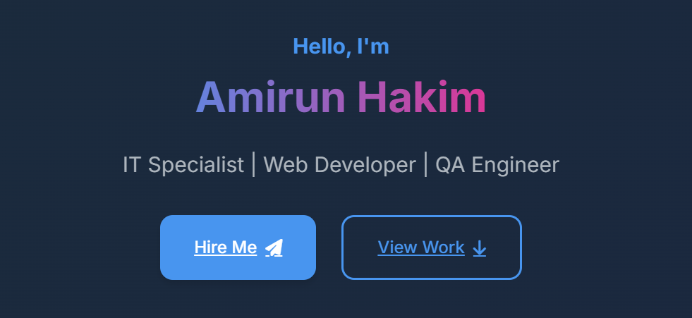

# Portfolio Website - Muhammad Amirun Hakim



A modern, responsive portfolio website showcasing my skills, experience, and projects as an IT Professional, Web Developer, and QA Engineer.

## Features

✨ **Modern UI Design**  
- Clean, professional layout with glass morphism effects
- Smooth animations and transitions
- Dark/light mode toggle

📱 **Fully Responsive**  
- Optimized for all device sizes (mobile, tablet, desktop)
- Adaptive layout and typography

🎨 **Interactive Elements**  
- Floating navigation with tooltips
- Animated skill bars
- Interactive project cards
- Smooth scrolling navigation

🌓 **Dark/Light Mode**  
- Automatic detection of system preference
- Manual toggle option
- Saves user preference

## Technologies Used

- **Frontend**: HTML5, CSS3, JavaScript
- **CSS Features**: Flexbox, Grid, Custom Properties (CSS Variables)
- **Animations**: CSS Transitions, Keyframe Animations
- **Icons**: Font Awesome
- **Font**: Inter (Google Fonts)

## Sections

1. **Hero Section** - Introduction with call-to-action buttons
2. **About Me** - Professional summary and key highlights
3. **Skills** - Technical skills with progress indicators
4. **Experience** - Timeline of professional experience
5. **Projects** - Showcase of featured projects
6. **Contact** - Multiple contact options with social links

## Installation

No installation required! Simply open the `index.html` file in any modern web browser.

For development purposes:

1. Clone the repository:
   ```bash
   git clone https://github.com/AmirunHakim7/portfolio.git
